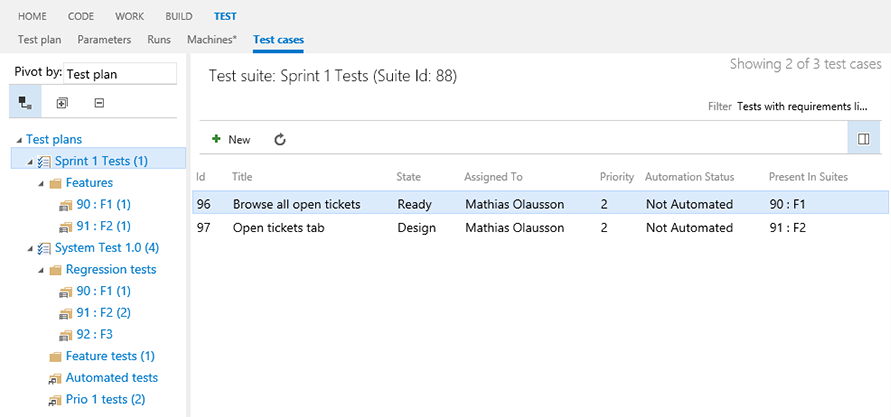

## Pivot, filter, edit and analyze usage of test cases ##

The more test cases you have in your project the more challenging it can be to find and work with associated and relevant tests. This extension helps you manage your test cases better.

### Pivot test cases ###
Pivot test cases by different dimensions such as `area path`, `iteration path`, `priority`, `state` and `test plan`.

### Show child suites ###

Toggle the `show child items` and the list will show all test cases in all suites for the test plan.

Using the right-side details pane and `Linked requirements` pane, select a test case to show the associated requirements.

### Filter and analyze test cases ###

Filter and analyze test cases to find tests not associated with any requirements, or tests that are not present in any suites (orphaned).

### Edit test cases ###

Edit test cases and assign them to any pivot by using drag and drop.

### Test case management ###

Add, edit and remove test cases from suites.

Add, move or clone test suites from one test plan to another using drag and drop.

Clone a test plan within the team project or to a different team project.

## Pricing ##

**Free**, but only Visual Studio Team Services users (not stakeholders) can be assigned the Test Case Explorer extension. Learn more about [Visual Studio Online Feature Matrix](https://www.visualstudio.com/pricing/visual-studio-online-feature-matrix-vs) and [Visual Studio Team Services user pricing](https://aka.ms/vs-pricing).

> Microsoft DevLabs is an outlet for experiments from Microsoft, experiments that represent some of the latest ideas around developer tools. Solutions in this category are designed for broad usage, and you are encouraged to use and provide feedback on them; however, these extensions are not supported nor are any commitments made as to their longevity.

## Prerequisites ##

- Team Foundation Team Services
- Team Foundation Server 2015 Update 2 (or higher)

**Note:** clone operations require Team Foundation Server 2017 (or higher)

## Contributors ##

We thank the following contributor(s) for this extension: Mathias Olausson and Mattias Sköld.

## Feedback ##

We need your feedback! Here are some ways to connect with us:

- Add a review below.
- Send us an [email](mailto://mktdevlabs@microsoft.com).

Review the [list of features and resolved issues of latest tools and extensions](https://aka.ms/vsarreleases) for information on the latest releases.
